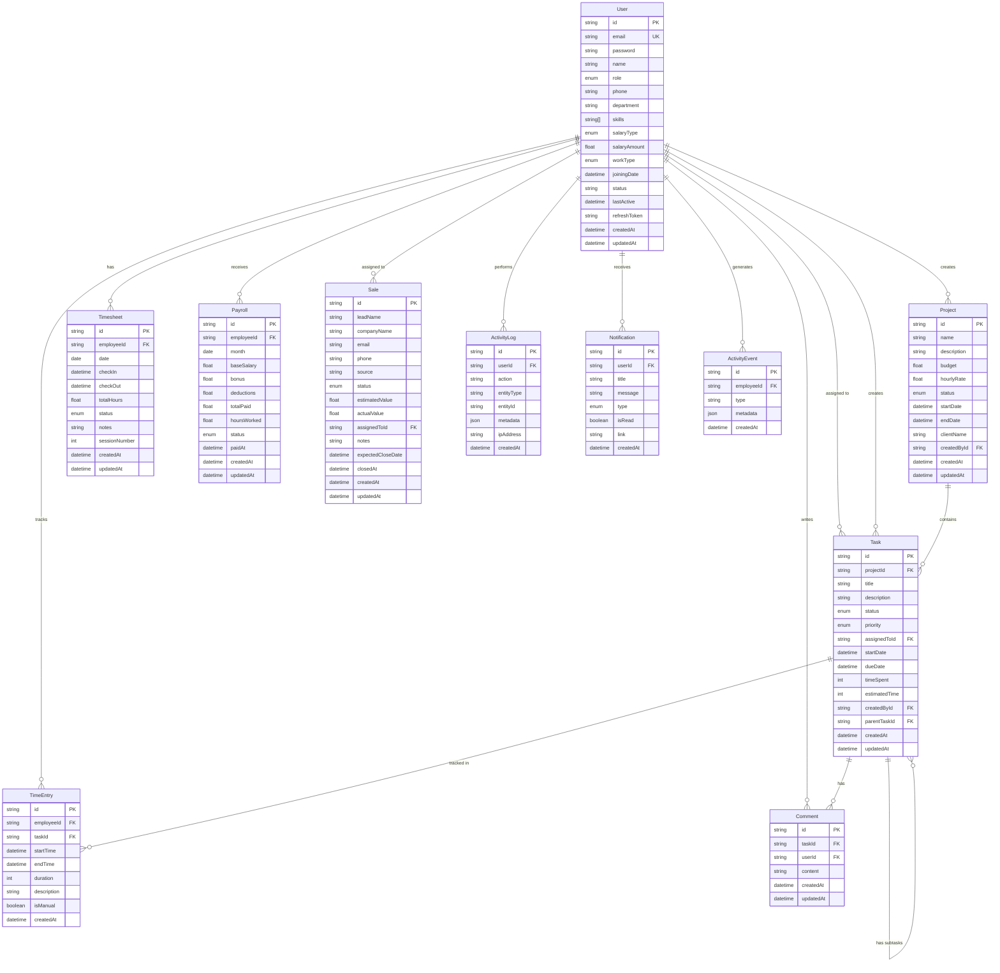

# Entity-Relationship Diagram

## Database Schema Overview

This document contains the ER diagram for the BrainGig CRM system database.

## Mermaid ER Diagram

## Entity Descriptions

### User
The central entity representing employees/users in the system. Supports multiple roles (ADMIN, HR, TEAM_LEAD, DEVELOPER, SALES, FINANCE) and work types (REMOTE, ONSITE).

**Key Relationships:**
- Creates Projects (one-to-many)
- Assigned to Tasks (one-to-many)
- Creates Tasks (one-to-many)
- Has Timesheets (one-to-many)
- Tracks TimeEntries (one-to-many)
- Receives Payroll (one-to-many)
- Assigned to Sales (one-to-many)
- Generates ActivityLogs (one-to-many)
- Receives Notifications (one-to-many)
- Writes Comments (one-to-many)
- Generates ActivityEvents (one-to-many)

### Project
Represents client projects with budget, timeline, and status tracking.

**Key Relationships:**
- Created by User (many-to-one)
- Contains Tasks (one-to-many)

### Task
Represents work items with support for subtasks, priorities, and status tracking.

**Key Relationships:**
- Belongs to Project (many-to-one)
- Assigned to User (many-to-one, optional)
- Created by User (many-to-one)
- Has Subtasks (self-referential, one-to-many)
- Tracked in TimeEntries (one-to-many)
- Has Comments (one-to-many)

### Timesheet
Tracks daily check-in/check-out times for employees. Supports multiple sessions per day for remote workers.

**Key Relationships:**
- Belongs to User (many-to-one)

**Unique Constraint:** (employeeId, date, sessionNumber)

### TimeEntry
Detailed time tracking entries linked to specific tasks.

**Key Relationships:**
- Belongs to User (many-to-one)
- Linked to Task (many-to-one, optional)

### Payroll
Monthly payroll records for employees.

**Key Relationships:**
- Belongs to User (many-to-one)

**Unique Constraint:** (employeeId, month)

### Sale
Sales leads and opportunities tracking.

**Key Relationships:**
- Assigned to User (many-to-one)

### ActivityLog
Audit log of user actions in the system.

**Key Relationships:**
- Performed by User (many-to-one)

### Notification
User notifications for various system events.

**Key Relationships:**
- Sent to User (many-to-one)

### Comment
Comments on tasks for collaboration.

**Key Relationships:**
- Belongs to Task (many-to-one)
- Written by User (many-to-one)

### ActivityEvent
Employee activity events (e.g., screenshots, activity monitoring).

**Key Relationships:**
- Generated by User (many-to-one)

## Enums

### UserRole
- ADMIN
- HR
- TEAM_LEAD
- DEVELOPER
- SALES
- FINANCE

### SalaryType
- FIXED
- HOURLY

### WorkType
- REMOTE
- ONSITE

### ProjectStatus
- PLANNING
- ACTIVE
- ON_HOLD
- COMPLETED
- CANCELLED

### TaskStatus
- TODO
- IN_PROGRESS
- REVIEW
- COMPLETED

### TaskPriority
- LOW
- MEDIUM
- HIGH
- URGENT

### SalesStatus
- NEW
- QUALIFIED
- PROPOSAL
- NEGOTIATION
- CLOSED_WON
- CLOSED_LOST

### PayrollStatus
- PENDING
- PROCESSED
- PAID

### TimesheetStatus
- PENDING
- APPROVED
- REJECTED

### NotificationType
- INFO
- SUCCESS
- WARNING
- ERROR

## Indexes

### User
- email (unique)
- role
- status

### Project
- status
- createdById

### Task
- projectId
- assignedToId
- status
- priority
- parentTaskId

### Timesheet
- employeeId
- date
- Unique: (employeeId, date, sessionNumber)

### TimeEntry
- employeeId
- taskId
- startTime

### Payroll
- employeeId
- month
- status
- Unique: (employeeId, month)

### Sale
- assignedToId
- status

### ActivityLog
- userId
- (entityType, entityId)
- createdAt

### Notification
- (userId, isRead)
- createdAt

### Comment
- taskId
- userId

### ActivityEvent
- (employeeId, createdAt)

## Cascade Rules

- **Project → Task**: Cascade delete (deleting a project deletes all its tasks)
- **Task → SubTask**: Cascade delete (deleting a parent task deletes all subtasks)
- **User → Timesheet**: Cascade delete
- **User → TimeEntry**: Cascade delete
- **User → Payroll**: Cascade delete
- **User → ActivityLog**: Cascade delete
- **User → Notification**: Cascade delete
- **User → Comment**: Cascade delete
- **User → ActivityEvent**: Cascade delete
- **Task → TimeEntry**: Set null on delete
- **Task → Comment**: Cascade delete
